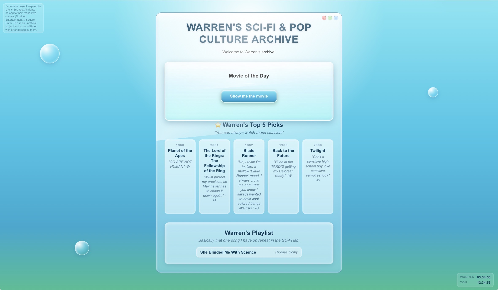

# Warren's Sci-Fi & Pop Culture Archive
A Life is Strange fan site inspired by Warren Graham, it's a small interactive archive about movies, music, sci-fi and much more!

## Try it
Live demo: https://pxls-png.github.io/stardance-archive/

## Quick Start
There is no setup, no installs and no build step needed. Just open the file.

1. Clone the repo: 
git clone https://github.com/PXLS-png/stardance-archive.git

2. Open 'index.html' in a browser (double-click)

That's basically it guys

## Features
- **Movie of the Day** is the main feature. It updates every day in Oregon time, since the game it's inspired from takes place there. 

- **Special date overrides** during the week Life is Strange (the 2015 game) takes place (Oct 7th-11th) there are special movies instead of the regular rotation. 

- **Top 5 movie picks** five films referenced in the Life is Strange universe, each shown with quotes from in-game characters (Max Caulfield, Chloe Price, Warren Graham) and a link to IMDb.

- **A song on repeat** "She Blinded Me With Science" by Thomas Dolby. There are enough references in game to assume Warren must be hearing that all day. 

- **Dual clocks** two time zones side by side, one is the user's local time, one Warren's. A small nod to the time travel theme, because that's what Life is Strange is all about!

- **Easter eggs** there are tons of easter eggs if you press certain things, look it up in the code, on special days etc. Many of them are also closely tied to the game!

## How It Works

- **HTML, CSS, and JavaScript only** 

- **Movie of the Day** uses `Intl.DateTimeFormat` with the `America/Los_Angeles` timezone to get today's date in Oregon, then it turns that date into a number. After that happens, it picks a position within the list, checks for special dates so they stay as they are, and then it shows the movie.

- **Special date overrides** work the exact same way, certain month-day pairs = specific movies instead of the normal rotation.

- **Frutiger Aero aethetic** glassy panels made with `backdrop-filter: blur()` and `::before` reflections. 

- **Mobile responsive** a media query at 600px shrinks the layout for phones. 

- **Hidden Features** there is a lot to explore even though its a pretty simple website! Always keep an eye open for the easter eggs!

## Personal Statement
My main idea with Warren's Sci-Fi & Pop Culture Archive was to turn my love for gaming and movies into a real project. 

## Credits
- **Life is Strange** and all characters belong to Dontnod Entertainment and Square Enix. This is an **unofficial fan project**, not affiliated with or endorsed by them.

- **Frutiger Aero aesthetic** inspired by the early-2000s design movement, and early windows aesthetic.

- Made for **Hack Club Stardance**

## Note
Fan project. Not official. Non-commercial. All rights belong to the owners.

